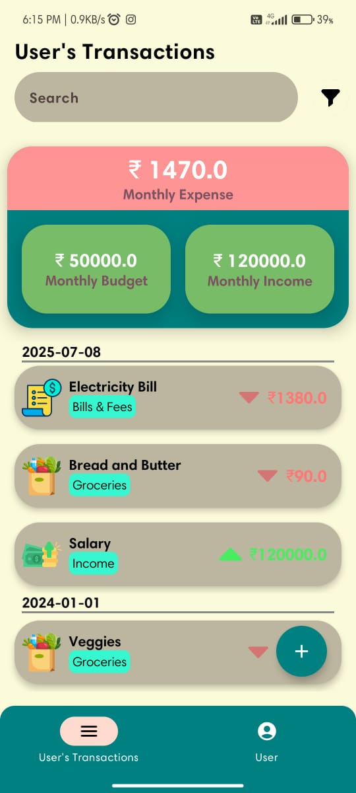
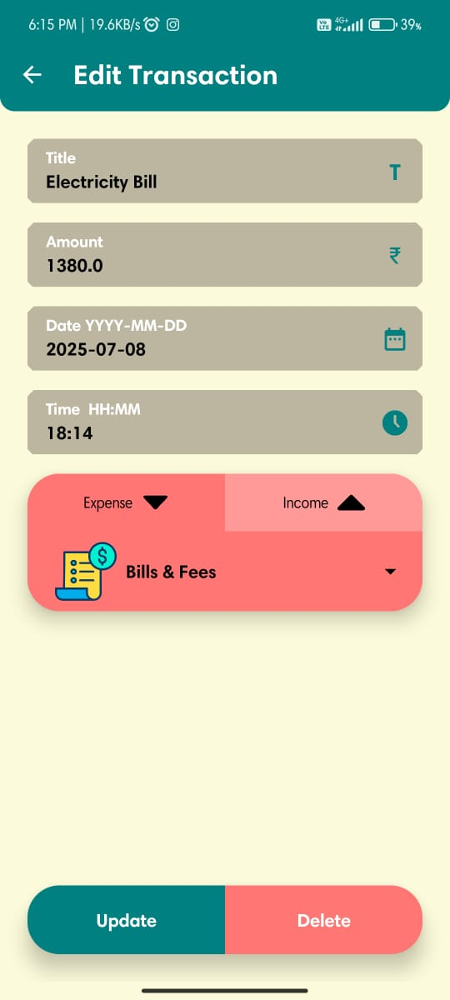
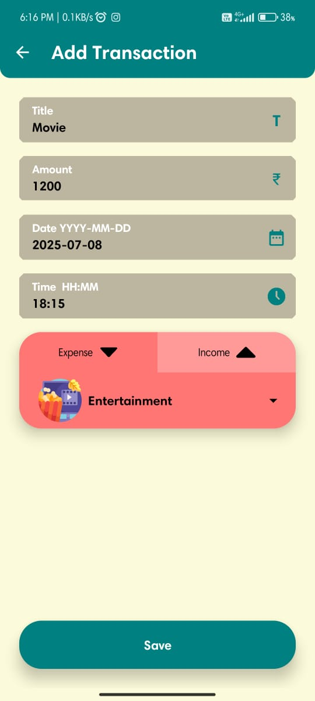
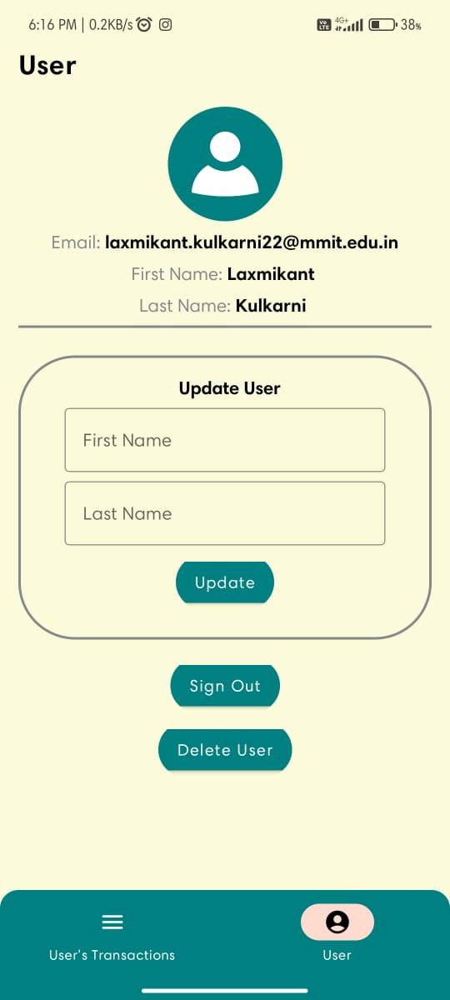

# Expense Ease 💸

**Expense Ease** is an educational Budget Tracker Android app developed using **Android Studio** and **Jetpack Compose**.  
It allows users to **track their expenses** and manage transactions securely with **Firebase Authentication** and **Cloud Firestore**.

This project showcases my ability to:
- Build apps using **Jetpack Compose**
- Implement **MVVM Clean Architecture**
- Integrate **Firebase Authentication** and **Firestore** for backend and database
- Perform full **CRUD (Create, Read, Update, Delete)** operations within an app

---

## 📱 Features
- User Authentication (Sign Up & Login)
- Add, View, Edit, and Delete Transactions
- Budget and Expense Tracking
- Modern & Responsive UI using Jetpack Compose
- Firebase Backend Integration
- MVVM Clean Architecture

---

## 🛠️ Tech Stack
- **Android Studio**
- **Jetpack Compose** (UI Toolkit)
- **Kotlin** (Programming Language)
- **Firebase Authentication**
- **Firebase Firestore** (Cloud Database)
- **MVVM Clean Architecture**

---
## 📂 Folder Structure

```plain text
app/
    ├── src/
        ├── main/
            ├── java/
                └── com/
                    └── example/
                        └── expenseease/
                            ├── data/
                                ├── BottomNavigationItemData.kt
                                ├── Injection.kt
                                ├── Screen.kt
                                ├── Transaction.kt
                                ├── User.kt
                                └── UserRepository.kt
                            ├── ui/
                                └── theme/
                                    ├── AddEditDelete.kt
                                    ├── backup.kt
                                    ├── Color.kt
                                    ├── Dismiss.kt
                                    ├── HomeView.kt
                                    ├── InventoryCard.kt
                                    ├── LoginScreen.kt
                                    ├── MainViewModel.kt
                                    ├── Navigation.kt
                                    ├── SignUpScreen.kt
                                    ├── Theme.kt
                                    ├── Transactions.kt
                                    ├── Type.kt
                                    └── UserDetails.kt
                            └── MainActivity.kt
            ├── res/
                ├── values/
                    ├── colors.xml
                    ├── strings.xml
                    └── themes.xml
            └── AndroidManifest.xml
    ├── build.gradle.kts
    └── proguard-rules.pro

gradle/
    └── wrapper/
        └── gradle-wrapper.properties

.gitignore
build.gradle.kts
gradle.properties
gradlew
gradlew.bat
README.md
settings.gradle.kts
```

## ⚠️ Disclaimer
This app is developed **for educational purposes only**  
It demonstrates my ability to:
- Build apps with Jetpack Compose
- Integrate Firebase with authentication & database
- Implement clean architecture & best practices

---

## 📸 Screenshots

### Home Screen



### Edit Transaction Screen



### Edit Transaction Screen 2


### Add Transaction Screen 



### User Info Screen




## 🚀 Getting Started

### Prerequisites:
* Android Studio (Flamingo or later recommended)
* Firebase Project (Firestore & Authentication enabled)

### Installation:
1. **Clone the Repository:**
   ```bash
   git clone https://github.com/yourusername/Expense-Ease.git
   ```

2. Open the project in **Android Studio**.

3. **Connect Firebase:**
   * Go to **Tools > Firebase** in Android Studio.
   * Connect your app to Firebase and enable Authentication & Firestore.

4. **Run the App:**
   ```bash
   Shift + F10
   ```

## 📄 License
This project is licensed for **educational & demonstration purposes only**.
